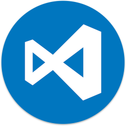

<h1 name="application_name">Code Server</h1>
</img>
<h2 name="title">Run VS Code on any machine anywhere and access it in the browser.</h2>
<h4 name="description">Code-server is a Visual Studio Code instance running on a remote server accessible through any web browser. It allows you to code anywhere and on any device such as a tablet or laptop with a consistent integrated development environment (IDE). Set up a secure a Linux development machine and get coding on any device with a web browser.</h4>
